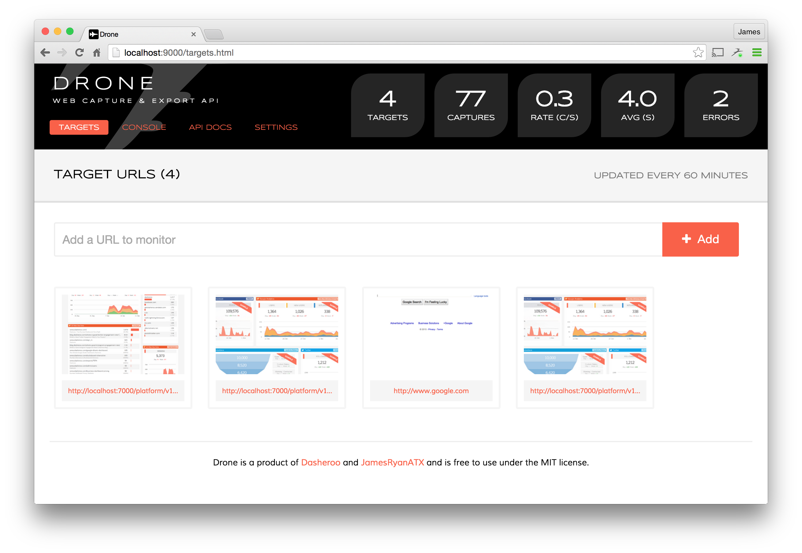

# Drone

A web capture and export microservice built around the PhantomJS headless browser.

<a href="doc/drone.targets.png"></a>
<a href="doc/drone.console.png"></a>

#### Features

* PNG and PDF support
* Multithreaded design
* Oodles of configuration parameters
* CSS, HTML and JavaScript injection for fine tuning
* A nice admin interface

#### Stack

* Ruby 2.1+
* Grape
* Rack
* PhantomJS
* Redis

## Setup

Use `docker-compose up`.

## Usage

### Command Line

```
# Dump current configuration
docker-compose run web bundle exec bin/drone config
```

### Web Interface

The admin UI is available at [http://localhost:9000/](http://localhost:9000/).
